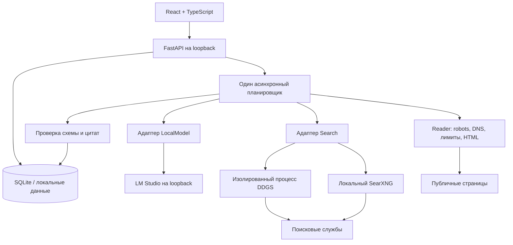

# Архитектура Locus

Дата исходного решения: 2026-09-21. Версия 0.1.

## Цель и ограничения

Локальное приложение для исследования публичных профилей и несекретных профессиональных сведений. Весь модельный анализ выполняется на компьютере пользователя. Ни ключи платных сервисов, ни облачный inference не входят в контракт системы. Запросы к обычным поисковым службам и публичным сайтам необходимы для поиска.

Важнейшие свойства: проверяемая связь результатов с источниками, разделение тёзок, управляемая длительность, восстановление после остановки и возможность менять компоненты без переписывания интерфейса.

## Структура

### Почему модульный монолит

Один локальный пользователь, одна GPU/общая память и последовательная модельная обработка не требуют Kubernetes, Redis, брокера сообщений или отдельной графовой базы. Такие компоненты усложнили бы установку и восстановление без доказанной пользы. FastAPI и SQLite дают явные границы модулей и достаточную основу для измерения нагрузки. Если несколько пользователей или устройств станут требованием, планировщик и storage можно заменить за этими границами.

### Почему собственный специализированный слой

Vane и GPT Researcher — полезные ориентиры для поиска и отчётов. Locus начинает с другой структуры данных: утверждение → цитата → прочитанная страница → отдельный кандидат → оценка пользователя. Код сторонних проектов в Locus не копировался. DDGS подключается как зависимость; SearXNG является внешним необязательным локальным сервисом.

## Контракты

- `Brief`: известное пользователю имя, варианты, ориентиры, языки, домены, ссылки и бюджет. Ориентир не превращается в установленный факт.
- `Settings`: локальный адрес и идентификатор модели, лимиты inference, поисковый адаптер и сетевые лимиты. Дополнительные неизвестные поля отвергаются.
- `Plan`: массив ограниченных по длине запросов с языком и объяснением. Это данные, не исполняемый код.
- `Extraction`: кандидаты, сопоставленные ориентиры, противоречия и типизированные утверждения с цитатой.
- `Source`: адрес, заголовок, прочитанный текст, время чтения, хэш содержимого или объяснение недоступности.

## Таблицы

`jobs` хранит brief, статус, активное время, число этапов и снимок конфигурации последнего запуска. `tasks` хранит долговечную очередь search/fetch/analyze и состояние каждого шага. `sources`, `candidates`, `events` ссылаются на job через внешние ключи. Удаление исследования каскадно удаляет его данные. `settings` содержит настройки без секретов. Схема имеет `PRAGMA user_version=1`.

Уникальный ключ задачи `(job_id, kind, key)` предотвращает повтор запроса или источника в рамках исследования. URL нормализуются; распространённые tracking-параметры удаляются, содержательные query-параметры сохраняются. DNS повторно проверяется при соединении, а не только при вводе URL.

## Жизненный цикл

`draft → queued → running → completed / paused`

Пользователь может продолжить `paused` или `completed` после изменения бюджета/ориентиров. Одновременно работает одно исследование. После перезапуска queued/running переводятся в paused; незавершённые задачи возвращаются в pending. Ожидание в очереди не входит в активное время. Таймер сохраняется каждые пять секунд, между шагами и при контролируемой остановке. Аварийное выключение может потерять не более последнего интервала между контрольными точками при нормально работающей базе.

Лимиты проверяются до каждого действия. Длительная операция получает оставшееся время через `asyncio.wait_for`. Отмена прямого поиска завершает его дочерний процесс; отмена чтения/модели закрывает клиентский запрос. Три последовательных отказа поиска ставят исследование на паузу. Отсутствие новых запросов завершает текущий проход без бесконечного цикла.

Для long-running использования в следующей версии нужен полноценный счётчик попыток, включая оборванные запросы; текущая семантика счётчиков зафиксирована в тестах.

## Проверка результата

1. Модель получает текст страницы как недоверенные данные и ограниченную схему результата.
2. Ответ проходит Pydantic-валидацию: неизвестные поля запрещены, категории ограничены.
3. После нормализации Unicode/пробелов каждая цитата должна присутствовать в реально переданном тексте.
4. Утверждения без такой цитаты отбрасываются.
5. Кандидат без оставшихся утверждений не сохраняется.
6. Каждая карточка имеет собственный источник. Автоматического слияния карточек разных страниц нет.

Это лишь первый уровень grounding. Нельзя называть такой факт истинным или кандидата идентифицированным. Дальнейшие этапы: проверка логического следования, сопоставление дат и ролей, независимости источников, видимое предложение объединения с решением человека.

## API

| Метод | Путь | Назначение |
|---|---|---|
| GET / PUT | `/api/settings` | Настройки локальной модели и поиска |
| GET | `/api/models` | Доступность и список моделей, без inference |
| GET / POST | `/api/jobs` | Список и создание исследований |
| GET / DELETE | `/api/jobs/{id}` | Состояние / удаление остановленного исследования |
| POST | `/api/jobs/{id}/start`, `/pause` | Управление выполнением |
| PUT | `/api/jobs/{id}/budget` | Изменение общего бюджета на паузе |
| POST | `/api/jobs/{id}/refine` | Новые ориентиры |
| POST | `/api/jobs/{id}/candidates/{cid}/review` | Оценка совпадения человеком |
| GET | `/api/jobs/{id}/export?format=md|json` | Локальный экспорт |

Изменяющие запросы требуют `X-Locus-Request: 1`. Origin и Host проверяются; CORS для внешних сайтов не включается. React выводит текст как текст, без выполнения HTML из источников.

## Что пересматривать при росте

- Пагинация результатов, журналов и планов вместо загрузки всех карточек.
- Очередь с попытками, контрольными точками и ограниченным повтором временных ошибок.
- Чтение страниц фрагментами, PDF/OCR и отдельный изолированный браузерный reader.
- Измеренная оценка и сортировка кандидатов; объединение только по явной доказательной связи.
- Единая клиентская оболочка Tauri после стабилизации процесса и установки.
- Подписанные релизы, миграции с резервной копией и проверенный откат.

## Изменения 0.2

- `i18n.ts` хранит предпочтения интерфейса в localStorage и оповещает React без сброса заполненного черновика. Общий каталог `backend/locus/assets/messages.json` поставляется вместе с backend и импортируется Vite при сборке. Содержимое источников не переводится автоматически при смене интерфейса.
- Семантические CSS-переменные отделяют палитру от компонентов; 12 комбинаций покрыты проверкой контраста главного экрана.
- `names.py` формирует ограниченные гипотезы написания без ИИ и сохраняет отличие гипотез от данных пользователя. `Brief` получает совместимые значения по умолчанию при чтении старых записей. Планировщик передаёт гипотезы локальной модели; решения об идентичности они не подтверждают.
- `LocalModel.capabilities()` читает локальный REST API LM Studio. В нативном режиме уровень thinking валидируется по текущей модели; интеграции пусты, сохранение чата на сервере выключено. JSON Schema остаётся в стандартном совместимом chat-режиме; локальная проверка структуры работает во всех режимах.
- `Search` использует только выбранные и установленные адаптеры, по одному за попытку. Это исключает неявный переход DDGS к `auto` для неизвестного движка. Каждый логический запрос использует до двух попыток. Таблица `search_runs` хранит движок, исход, время, число результатов и ошибку. При отмене сохраняется отменённая попытка.
- Схема 2 добавляет только `search_runs`. Перед миграцией схемы 1 SQLite backup API создаёт согласованную копию. Новые поля внутри JSON читаются с дефолтами; прежние задания не перезапускаются.
- `reports.py` строит анализ из записанных действий, без дополнительного вызова ИИ. Общие смысловые блоки используются для PDF и Markdown; JSON сохраняет структурированные данные. Экспорт содержит снимок состояния на момент запроса. PDF создаётся в рабочем потоке, без блокирования исследовательской очереди.
- Noto Sans Regular/Bold включены в дистрибутив по OFL. Проверены латиница и кириллица; полный набор письменностей, в частности CJK, требует дополнительных шрифтов. Markdown/JSON сохраняют исходный Unicode.

## 0.3: revisions, explainable evidence and local archive

SQLite schema 3 adds `jobs.revision`, `tasks.revision`, `candidates.review_revision` and `revisions`. Before upgrading schema 1 or 2, SQLite backup creates a private `.vN.backup.sqlite3` file. Every existing job receives revision 1. Brief additions have defaults for older jobs.

`POST /api/jobs/{id}/continue` accepts a validated brief, optional additional budget and explicit start flag. Active jobs cannot be changed. A single transaction snapshots the old assessments, stores the new criteria and supersedes pending tasks. Completed tasks remain auditable. Search deduplication is scoped to a criteria revision; fetched URLs retain their global per-project deduplication. Previously superseded fetches can be queued again when newly discovered. Old source text is retained, not automatically refetched. Counters are cumulative; additional budget produces absolute limits from actual consumed counters, with active minutes rounded up. Model planning receives current criteria and prior public findings with review/evidence state.

`evidence.py` is deterministic and model-independent. Unicode-normalized whole-phrase matches compare supplied names and typed education/organization/public-work clues with grounded quotations. Model judgments cannot raise support. Missing clues are not contradictions, and identity is not established. The score is ordinal, not calibrated; automatic cross-card merging remains disabled. Current source-domain filters determine reversible archive visibility; old manual reviews are marked stale after any criteria revision.

`archive.py` uses SQLite as authority and maintains rebuildable `data/projects/<hex id>/` snapshots on events, shutdown of a search, startup and export. Writes use private permissions and temporary-file replacement. An archive lock serializes snapshot export/deletion. Fixed generated names, escaped HTML, restrictive offline CSP and symlink checks prevent document injection and path escape. Exports contain source metadata and recorded quotations, never whole scraped bodies. ZIP adds a locally generated PDF from the same snapshot. No archive import yet; exported copies and migration backups are independent of project deletion. The archive is not an independently crash-atomic database: interrupted writes are repaired from SQLite at startup/export.

Large-scale performance, whole-site archival, page refresh and model-based semantic reevaluation of every old page are not implemented. Current reevaluation is quote/clue matching and filter review; new model work begins only after an explicit search start.
