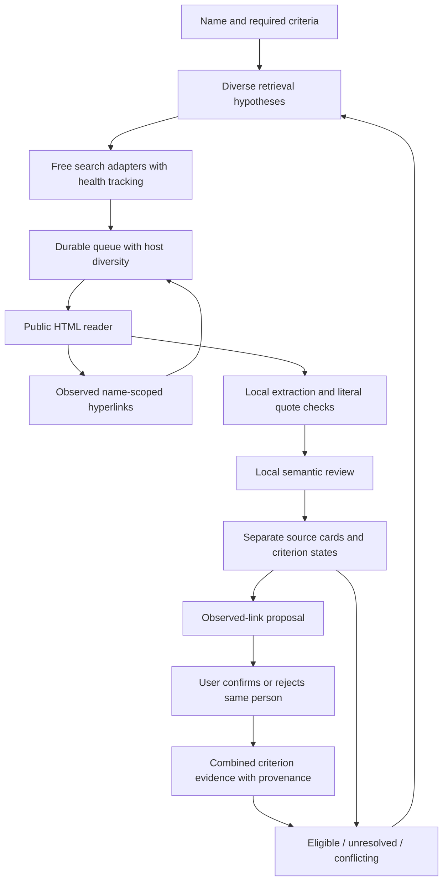

# Engine 0.6 — discovery, source trails, reviewed linkage

## Data flow

The local modular monolith, SQLite and one worker remain appropriate for a single-user workstation. More processes, a vector database or an agent framework would not fix missing sources or identity attribution. The change is the evidence flow, not infrastructure volume.

## Discovery versus decision

`discovery.py` builds bounded name-and-context queries, including broader name probes, and interleaves them with local-model plans. Name hypotheses include both Cyrillic-to-Latin and bounded Latin-to-Cyrillic alternatives for known given names. City romanizations are hypotheses; no geographic-ID resolver is claimed. Queries target individual missing criteria instead of demanding all of them on every retrieved page. Every result still passes the unchanged required-criterion gate.

This supersedes 0.5's unconditional original-geography suffix, which could make translated queries impossible. The system deliberately tolerates irrelevant *retrieval candidates*; it does not label them as matching people.

## Observable source trails

The HTML reader retains up to 100 public URL/context records, excluding navigation/header/footer links. A named main heading plus a same-site biography/resume/publications link is also retained as a profile navigation lead. It also reads Person `sameAs` declarations as untrusted metadata. A scoped name must be present in the paragraph/anchor or metadata person name for a lead to be followed. At most six relevant links per page, two link hops, and the existing total page/time/domain budgets apply. No model-generated URL is executed. Redirect source aliases are preserved. A cached source keeps a coherent previous snapshot rather than mixing new links with old text.

Links are leads. A shared name, website link or structured metadata can be wrong. Neither automatically joins records or proves identity. Old saved pages have no retroactively reconstructed HTML links; new reads collect them. Cached source refresh is not yet a product feature.

## Human-reviewed evidence graph

`linkage.py` builds proposals from observed page-to-page edges and reviewed candidate records. The API only accepts a decision for an existing proposal in the same project, while paused. Decisions are versioned with the criteria and reversible. Original cards and individual assessments remain intact.

Confirmed edges form groups. For each requested criterion, the group shows the supporting or contradicting quotations with candidate/source IDs. Unknown criteria remain unknown. Any contradiction dominates a positive check. Rejected, excluded, unreviewed or stale records cannot silently supply current positive support. Changing criteria requires fresh audits and link decisions. A link confirmation means the records describe the same person; it does not certify the truth of every source or waive target criteria.

Source families group identical text hashes or the same host. This prevents obvious copies from being counted as separate origins, but does not establish true independence: related subdomains, syndication and common ownership are not exhaustively resolved. Family count does not multiply a confidence score.

## Scheduling, availability and persistence

Pages without any configured full-name hypothesis are skipped before extraction, using the same necessary name condition as the semantic validator. This saves inference but cannot recognize an entirely unlisted name. Review/extraction precede further network work. After two fetches, a pending search gets a turn; subsequent fetch selection penalizes already-read hosts. Provider health tracks two consecutive failures and a 120-second cooldown, with up to three selected adapter attempts per logical query. Recent recorded attempts restore this state after a restart. No captcha/login bypass or unselected service fallback is introduced.

Analysis task keys now include criteria revision, allowing previously empty pages to be reconsidered after explicit continuation. Existing cards are reviewed rather than destructively replaced. Re-extracting a different person from a previously nonempty page, page refresh, unbounded pagination and process-safe parallel scheduling remain future work.

Schema 5 adds `sources.links`, `sources.url_aliases`, and `link_decisions`. Migration uses SQLite backup for schemas 1–4. JSON defaults make old records readable. Launch does not run a model; active research is recovered to paused. Archives and PDF/Markdown/JSON include the combined evidence and preserve source provenance.

## Quality boundaries

The deterministic suite checks mechanisms; replay isolates the engine using scripted semantics; the optional local-model replay tests actual extraction and review on fictional pages. The public smoke uses one known public professional target and a supplied URL. None measures blind real-world recall or commercial competitors. See [validation](VALIDATION.md).

Still needed for professional reliability: geographic entities and alias resolution, typed temporal relations, representative consented/public labelled data, calibrated decisions, broader readable formats and robust source availability. Do not market a 100% result guarantee or superiority from a passing test suite.
